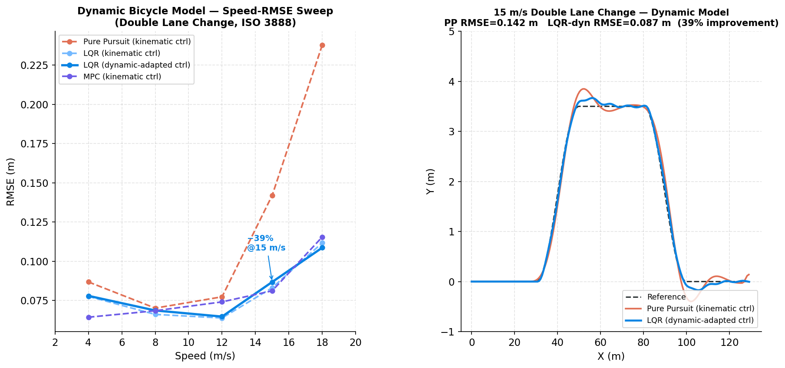
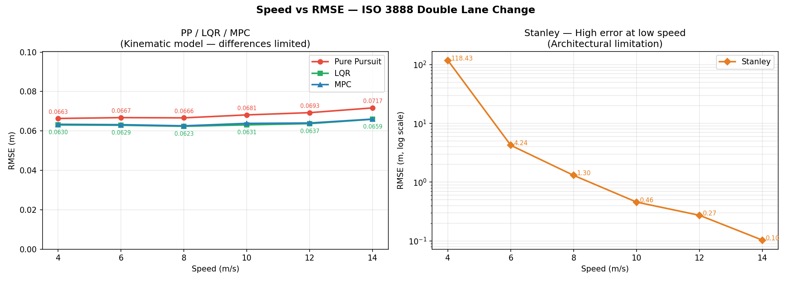
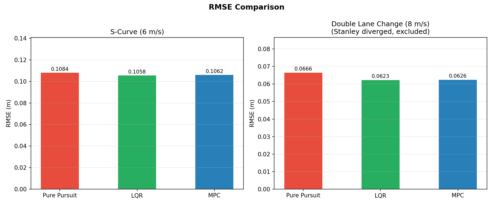
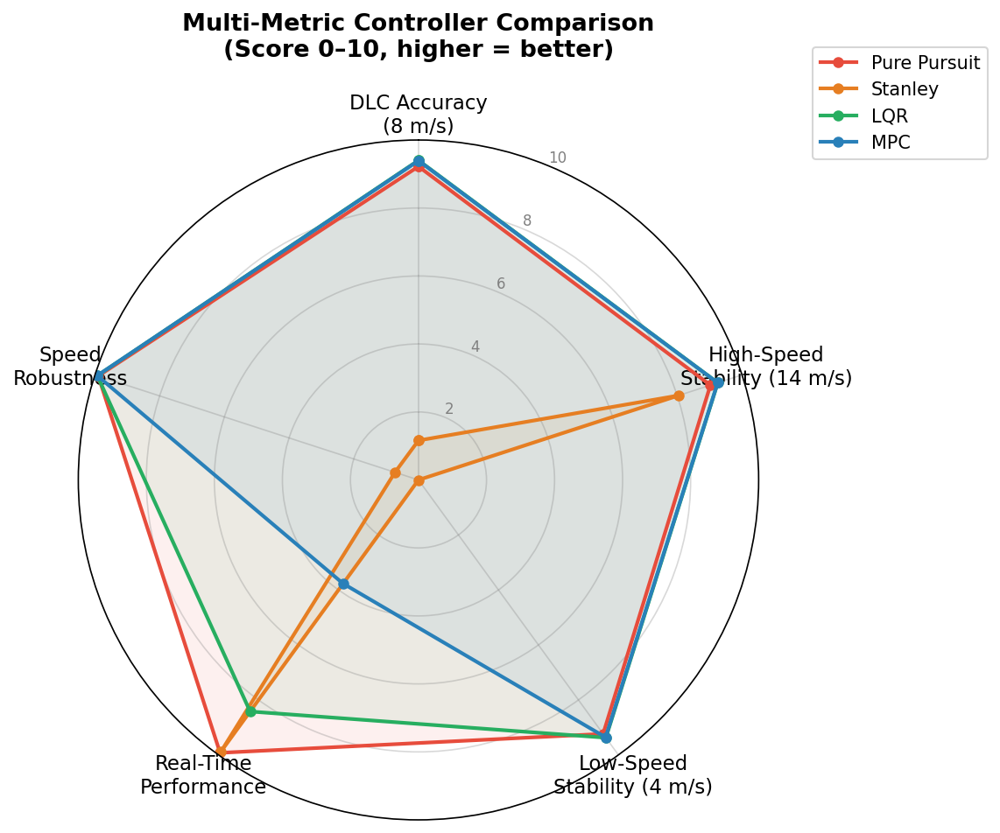
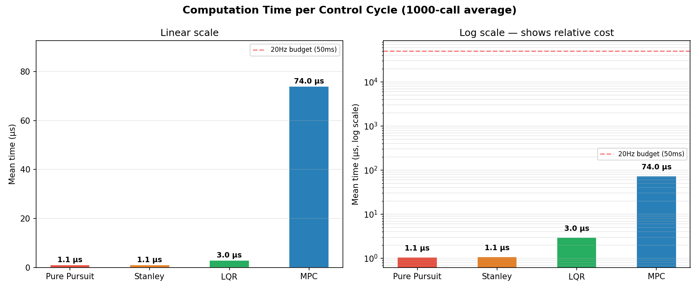

<div align="center">

# AV Control Benchmark

**自动驾驶控制算法的实践研究——从运动学仿真到 CARLA 物理引擎**

[English](README.md) · [反馈问题](../../issues)

</div>

---

## 为什么做这个项目

我想真正理解自动驾驶汽车是如何控制方向的——不只是读 PID 和 MPC 的公式，而是亲手实现它们、让它们出错、然后用数据量化各自到底好在哪、差在哪。

这个仓库是结果：五种横向控制算法从零用 C++ 实现，在三种仿真精度下做对比测试，最终接入 CARLA 完成闭环验证。这是一个学习与研究性质的项目——目的是把纸面上的控制理论和真正能让车留在路上的控制理论之间的差距补上。

如果你正在学习自动驾驶控制，或者只是好奇 Apollo/Autoware 这类控制模块是怎么搭起来的，希望这个项目对你有用。

---

## 演示


*Pure Pursuit 控制器驱动 Tesla Model 3 在 CARLA Town03 里行驶，通过 ROS2 闭环控制——参考轨迹实时生成，车辆状态以 20Hz 反馈。*

---

## 项目内容

五种控制器，在完全相同的条件下实现并对比：

| 控制器 | 类型 | 是否预测未来 | 是否处理约束 |
|---|---|---|---|
| PID | 纵向速度控制 | ❌ | ❌ |
| Pure Pursuit | 几何路径跟踪 | ❌ | ❌ |
| Stanley | 几何（前轴误差） | ❌ | ❌ |
| LQR | 最优状态反馈 | ❌（无限时域） | ❌ |
| MPC | 滚动时域优化 | ✅（N 步预测） | ✅（QP 约束） |

在**三种仿真精度**下测试，每一层都揭示更大的控制器差距：

```
第一层 — 运动学自行车模型（Python + C++）
   ↓  引入轮胎侧偏力 + 横摆动力学
第二层 — 动态自行车模型（C++，RK4 积分）
   ↓  引入真实物理引擎
第三层 — CARLA（PhysX，ROS2 闭环）
```

**核心发现：** 运动学模型"过于理想"——它掩盖了简单几何控制器和优化类控制器之间真正的性能差距。只有当轮胎动力学被纳入考量后，差距才会真正显现。

| 层次 | 模型 | PP vs 最优控制器（双移线场景）|
|---|---|---|
| 第一层：运动学 | 不打滑假设，v < 8 m/s | **6%** |
| 第二层：动态 | 线性轮胎模型，侧偏角 β，横摆角速度 r | **39%**（15 m/s），54%（18 m/s）|
| 第三层：CARLA | 真实 PhysX 车辆物理 | 闭环演示已验证 |



---

## 详细结果

### 第一层——运动学模型，ISO 3888 双移线（8 m/s）

| 控制器 | RMSE | 计算耗时 |
|---|---|---|
| Pure Pursuit | 0.067 m | 1.1 μs |
| Stanley | 1.30 m *（见下方说明）* | 1.1 μs |
| LQR | 0.062 m | 3.0 μs |
| MPC | 0.063 m | 74 μs |

> Stanley 在此处的表现不是 Bug，而是控制律在高速场景下的已知局限。Stanley 的横向误差修正项随 `1/v` 衰减，因此高速时几乎完全依赖航向误差修正——而这在换道场景中会滞后于快速变化的参考航向。Stanley 的设计初衷（及优势场景）是低速泊车这类精细操控。





MPC 74μs 的计算耗时是 **20Hz 控制周期（50ms 预算）的 0.15%**——实时性在此规模下完全不是问题。



### 第二层——动态自行车模型（轮胎侧偏 + 横摆惯量）

| 速度 | Pure Pursuit | LQR（动态适配） | 改善幅度 |
|---|---|---|---|
| 4 m/s | 0.087 m | 0.078 m | 10% |
| 8 m/s | 0.070 m | 0.069 m | 2% |
| 12 m/s | 0.077 m | 0.065 m | 16% |
| **15 m/s** | **0.142 m** | **0.087 m** | **39%** |
| 18 m/s | 0.238 m | 0.109 m | 54% |

12 m/s 以上，Pure Pursuit 的误差随轮胎侧偏角显著增大而急剧上升——它只考虑当前几何关系，不考虑车辆动力学。LQR 适配了动态模型的横摆响应（用 `Cf·lf/Iz` 替代运动学的 `v/L`）后，保持了稳定。

### 第三层——CARLA

ROS2 控制回路（轨迹发布 → 控制器节点 → CARLA 桥接节点）驱动真实车辆在 CARLA 物理引擎中行驶。过程中解决的关键工程问题：

- **坐标系**——CARLA 是左手坐标系（yaw 顺时针），ROS 是右手坐标系。通过锚定在车辆稳定后位姿的本地坐标系解决。
- **生成后稳定**——`spawn_actor()` 后立即采样参考位姿会把物理引擎的稳定噪声误判为航向误差，延迟 2 秒采样后解决。
- **路点方向**——CARLA 的 `waypoint.next()` 沿交通方向前进，根据 spawn 朝向的不同可能与车辆朝向相反，已自动检测并修正。

---

## 系统架构

```
                     ┌─────────────────────┐
                     │      轨迹来源        │  （固定路径 / CARLA 路点）
                     └──────────┬───────────┘
                                │ /trajectory
                     ┌──────────▼───────────┐
                     │   controller_node    │  PID + {PP | Stanley | LQR | MPC}
                     │        (C++)         │
                     └──────────┬───────────┘
                                │ /vehicle_cmd
              ┌─────────────────┴─────────────────┐
              │                                     │
   ┌──────────▼──────────┐              ┌──────────▼──────────┐
   │  sim_bridge_node.py  │              │ carla_bridge_node.py │
   │  （运动学/动态模型）   │              │   （CARLA PhysX）     │
   └──────────┬──────────┘              └──────────┬──────────┘
              └─────────────────┬─────────────────┘
                                │ /vehicle_state (20 Hz)
                                ▼
                          回到 controller_node
```

替换物理后端（运动学模型 / 动态模型 / CARLA）只需换一个节点，控制器代码完全不变。

---

## 技术栈

| 组件 | 选型 | 理由 |
|---|---|---|
| 控制器核心 | C++17 | 实时性要求，行业标准 |
| QP 求解器（MPC）| OSQP（osqp-eigen）| 基于 ADMM，对稀疏矩阵友好，Apollo 同款 |
| 线性代数 | Eigen3 | Header-only，SIMD 优化，表达式模板 |
| 中间件 | ROS2 Humble | 节点解耦架构，基于 DDS |
| 仿真器 | CARLA 0.9.15 | 行业标准自动驾驶仿真器，真实物理（PhysX）|
| 原型/可视化 | Python 3.10, NumPy, Matplotlib | C++ 移植前的快速迭代 |
| 测试 | Google Test | 控制器边界条件单元测试 |
| 构建 | CMake 3.22+ | ROS2/C++ 标准 |

---

## 项目结构

```
av-control-benchmark/
├── python_prototype/          # 第零层：Python 算法验证
│   ├── models/                #   运动学/动态自行车模型
│   ├── controllers/           #   PID、Pure Pursuit（Python 参考实现）
│   └── carla_bridge/          #   早期 CARLA 集成实验
│
├── cpp_controllers/           # 第一/二层：C++ 控制器核心
│   ├── include/                #   bicycle_model、dynamic_bicycle_model、
│   │                           #   pid、pure_pursuit、stanley、lqr、mpc
│   ├── src/                    #   实现 + main.cpp 基准测试驱动
│   ├── tests/                  #   Google Test 单元测试
│   ├── scripts/                #   matplotlib 可视化脚本
│   └── results/                #   生成的图表和 CSV 数据
│
├── ros2_ws/                   # 第三层：ROS2 + CARLA 集成
│   └── src/
│       ├── av_control_msgs/    #   Trajectory / VehicleState / VehicleCmd
│       └── av_controller/      #   controller_node、carla_bridge_node
│
└── results/                   # 顶层演示素材（GIF）
```

---

## 编译与运行

### C++ 控制器 + Benchmark

```bash
sudo apt install build-essential cmake libeigen3-dev libgtest-dev
# OSQP + osqp-eigen 需要从源码编译：https://osqp.org

cd cpp_controllers
mkdir build && cd build
cmake .. && make -j4
./run_simulation          # 运行完整 Benchmark，写入 results/*.csv
ctest                     # 运行单元测试

cd ../scripts
python3 plot_dynamic_comparison.py   # 从 CSV 重新生成图表
```

### ROS2 + CARLA

需要 CARLA 0.9.15 已运行（本地或可访问的主机），并安装 ROS2 Humble。

```bash
cd ros2_ws
colcon build --packages-select av_control_msgs av_controller
source install/setup.bash

# 接入 CARLA（若不在 localhost，调整 carla_host 参数）
ros2 launch av_controller carla_system.launch.py spawn_index:=1 speed:=4.0

# 或用轻量级 Python 仿真器（不需要 CARLA）
ros2 launch av_controller full_system.launch.py
```

---

## 后续计划

- 针对大侧偏角工况的非线性 MPC（线性轮胎模型在此失效）
- 加入状态估计（EKF）融合 GPS+IMU，替代直接读取仿真器真值状态
- 在 CARLA 中对齐真实道路几何完成完整的双移线测试（目前的演示展示了直线闭环控制，量化的双移线对比数据在第一、二层中完成）

---

## 作者

一名正在通过从零构建控制系统来学习自动驾驶控制的本科生。欢迎反馈和 Issue。

## 致谢

架构设计参考了 [Apollo](https://github.com/ApolloAuto/apollo) 和 [Autoware](https://github.com/autowarefoundation/autoware.universe) 的控制模块设计。开发过程中使用 Claude AI 辅助调试和文档撰写。

## 许可证

MIT
